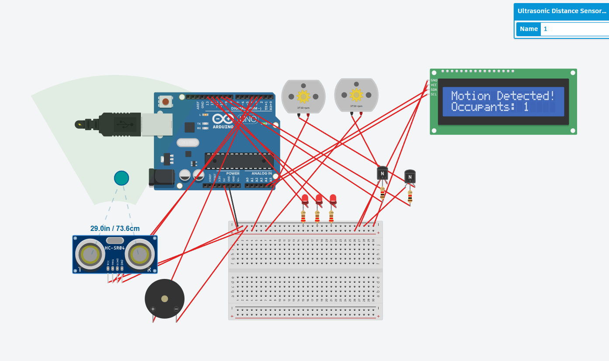

# OfficeIQ - Smart Office Energy Intelligence Platform

OfficeIQ is an intelligent, real-time IoT facility monitoring system designed for modern offices. It integrates a live simulated hardware backend, a glassmorphism React dashboard, and a conversational Discord bot powered by a DigitalOcean AI Agent.

This project was built for the IUT Techathon Nationals & Rover Summit.

---

## 🚀 Live Demo & Judging Links

Judges can instantly test the real-time nature of OfficeIQ here:

1. **Live Dashboard:** [https://officeiq.safeshare.co](https://officeiq.safeshare.co)
2. **Interactive AI Discord Bot:** [INSERT YOUR DISCORD INVITE LINK HERE]

**Try this live test:** Open the dashboard and the Discord server side-by-side. Type `!toggle Drawing Room Light 1` in Discord, and watch the dashboard light switch instantly animate and the power consumption graph spike!

---

## Architecture: The Monolith Advantage

To ensure zero latency and perfect synchronization, OfficeIQ uses a Single-Process Monolith architecture:
1. In-Memory State: A single Node.js backend serves as the absolute source of truth for all 15 devices across 3 rooms.
2. WebSockets (Socket.io): Instantly pushes state changes to the React dashboard without polling.
3. Discord Bot: Reads directly from the same memory space to guarantee the bot and dashboard are never out of sync.

### High-Level System Architecture


## Key Features

*   Live UI Reactivity: CSS animations for fans and lights that react instantly to backend events.
*   Power History Graph: Recharts integration showing a rolling 30-minute consumption trend.
*   Intelligent Alert Engine: Automatically detects "Power Spikes" and "Vampire Drains" (after-hours usage), alerting both the UI and Discord.
*   Proactive Smart Alerts: The backend dynamically checks for empty rooms with devices left on and pushes specific warnings.
*   Conversational AI Manager: The Discord bot uses a DigitalOcean MiniMax M2.5 AI agent to provide human-readable, contextual summaries of office energy usage based on real-time data.

---

## Getting Started

### 1. Backend Setup

```bash
cd backend
npm install
```

Create a `.env` file in the `backend` directory (ignored by git):
```env
DISCORD_TOKEN=your_bot_token
DISCORD_CHANNEL_ID=your_channel_id
DO_AI_ENDPOINT=your_do_ai_agent_endpoint
DO_AI_API_KEY=your_do_ai_api_key
```

Run the server:
```bash
node server.js
```
*(The backend runs on http://localhost:3001 and starts the simulator loop immediately).*

### 2. Frontend Dashboard Setup

```bash
cd frontend
npm install
npm run dev
```
*(The frontend runs on http://localhost:5173).*

---

## Discord Bot Commands

*   `!help` - Displays the full list of available commands and descriptions.
*   `!status` - Returns a beautifully formatted embed showing exactly what is ON/OFF in each room.
*   `!room <name>` - Shows the detailed status of a specific room (e.g. `!room work 1`).
*   `!toggle <device>` - Manually toggle any device directly from Discord (e.g. `!toggle Drawing Room Fan 1`).
*   `!usage` - Shows current power draw (Watts) and estimated operational cost per hour.
*   `!report` - Generates an AI incident report for any after-hours energy waste.
*   `!boss <question>` - Ask the DigitalOcean AI Agent conversational questions about the live building state.

---

## Hardware Simulation
While this is a software simulation, the backend logic maps directly to a physical hardware prototype built and simulated in Tinkercad. 

### Electrical Schematic




The prototype uses an **Arduino Uno** to control a representative smart room:
*   **3x LEDs** (representing smart lights)
*   **2x DC Motors** (representing smart ceiling fans)
*   **1x Ultrasonic Distance Sensor (HC-SR04)** (Acting as a doorway break-beam to accurately count occupants)
*   **1x I2C LCD Display (16x2)** (Live physical dashboard showing the current occupant count)
*   **1x Piezo Buzzer** (Audible 'door chime' confirming occupant entry)

When a person breaks the ultrasonic beam, the Arduino increments the room count and instantly updates the physical LCD screen. As long as the count is >0, the lights and fans are powered on. When the count reaches 0, the system shuts down, perfectly mimicking the Node.js backend simulator.

📄 **[View the Full Hardware Schematic (PDF)](hardware/office%20iq.pdf)**
💻 **[View the Arduino Source Code](hardware/office_iq_node.ino)**
