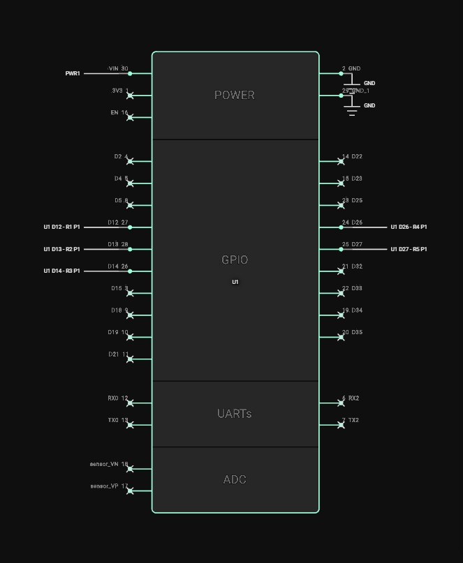
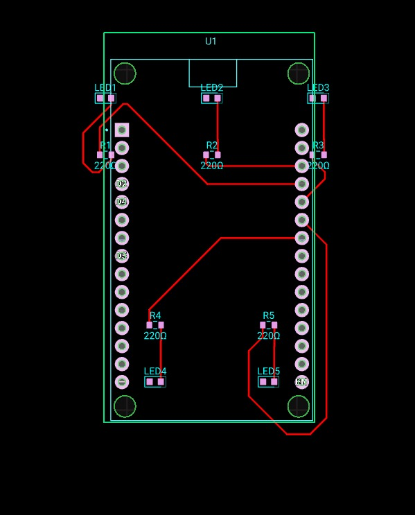

# OfficeIQ (Lights, Fans, Discord) ⚡🏢

OfficeIQ is an intelligent, real-time IoT facility monitoring system designed for modern offices. It integrates a live simulated hardware backend, a glassmorphism React dashboard, and a conversational Discord bot powered by a DigitalOcean AI Agent.

This project was built for the **IUT Techathon Nationals & Rover Summit**.

---

## 🏗️ Architecture: The Monolith Advantage

To ensure zero latency and perfect synchronization, OfficeIQ uses a **Single-Process Monolith** architecture:
1. **In-Memory State**: A single Node.js backend serves as the absolute source of truth for all 15 devices across 3 rooms.
2. **WebSockets (Socket.io)**: Instantly pushes state changes to the React dashboard without polling.
3. **Discord Bot**: Reads directly from the same memory space to guarantee the bot and dashboard are never out of sync.

## ✨ Key Features

*   **Live UI Reactivity**: CSS animations for fans and lights that react instantly to backend events.
*   **Power History Graph**: Recharts integration showing a rolling 30-minute consumption trend.
*   **Intelligent Alert Engine**: Automatically detects "Power Spikes" and "Vampire Drains" (after-hours usage), alerting both the UI and Discord.
*   **Sarcastic AI Manager**: The Discord `!boss` command uses a DigitalOcean MiniMax M2.5 AI agent to provide humorous, human-readable summaries of office energy usage.

---

## 🚀 Getting Started

### 1. Backend Setup

```bash
cd backend
npm install
```

Create a `.env` file in the `backend` directory (ignored by git):
```env
DISCORD_TOKEN=your_bot_token
DISCORD_CHANNEL_ID=your_channel_id
```

Run the server:
```bash
node server.js
```
*(The backend runs on `http://localhost:3001` and starts the simulator loop immediately).*

### 2. Frontend Dashboard Setup

```bash
cd frontend
npm install
npm run dev
```
*(The frontend runs on `http://localhost:5173`).*

---

## 🤖 Discord Bot Commands

*   `!status` - Returns a beautifully formatted embed showing exactly what is ON/OFF in each room.
*   `!usage` - Shows current power draw (Watts) and estimated operational cost per hour.
*   `!boss` - Generates an AI-powered summary of the current office state with a sarcastic facilities manager persona.

---

## 🔌 Hardware Simulation
While this is a software simulation, the architecture is designed to map directly to physical hardware. We have designed a complete ESP32 schematic and PCB layout for a representative room (2 Fans, 3 Lights).

### Electrical Schematic
*(The ESP32 uses internal `INPUT_PULLUP` resistors to read the states, mapped to GPIO 12, 13, 14, 26, 27).*



### PCB Layout Routing
*(Custom PCB routing demonstrating the physical viability of the monitor node).*


